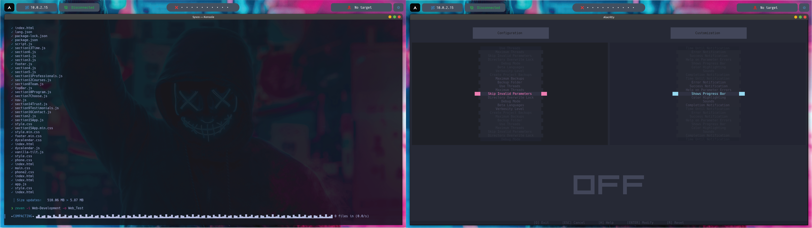

<p align="center">
  <br>
  </a>
  
  
  
  <br>
  A <i>Zeven</i> lifes for advanced developers.
</p>

<p align="center">
  <a href="#key-features-and-overview">Key features and overview</a><br>
  <a href="#installation-for-windows">Installation for Windows</a><br>
  <a href="#installation-for-linux-and-macos">Installation for Linux and MacOS</a><br>
  <a href="#how-to-use">How to use</a><br>
  <a href="#using-setting-mode">Using setting mode</a><br>
  <a href="#setting-mode-configuration">Setting mode: Configuration</a><br>
  <a href="#setting-mode-customization">Setting mode: Customization</a><br>
  <a href="#available-languages">Available languajes</a><br>
  <a href="#parameters-cheatsheet">Parameters cheatsheet</a><br>
  <a href="#possible-errors">Possible errors</a><br>
  <a href="#project-goals-and-future-ideas">Project goals and future ideas</a><br>
  <a href="LICENSE">License</a><br><br><br><br>
  <br>
</p><br>

---

<br>


# Key Features and Overview
**`Zeven`** is a command-line tool designed to efficiently format and/or compact code, making it more readable and maintainable, or alternatively reducing its size and processing time.<br><br>


>[!tip]
> Designed as an open-source project, focused on optimization and accessibility for developers and teams.
> 
> 100% Built with Python

- Compatible with Windows, Linux, and macOS
- Supports multiple specific formats
- Allows custom configurations
- Extremely fast for large projects
- Parallel execution with threads to maximize performance
- Includes an interactive configuration mode for ease of use
- Particularly useful for web projects

<br>

# Install
>[!IMPORTANT]
> Do not clone the repository or run the tool as root or administrator user, it will fail when running.

 
- As a first step it is important to emphasize that you need to have **git installed**, you can install it from <a href="https://git-scm.com/downloads">here</a>. After that you simply have to clone this repository:
   ```powershell
   git clone https://github.com/Syyysco/Zeven.git
   ```
- If you have already installed the tool and want to remove everything, simply go to the tool folder (where you cloned or moved it) and run the following command:
  ```
  pip3 uninstall -r requirements.txt
  ```
> In the case of Windows, change requirements.txt to win-requirements.txt

<br>

## Installation for Windows
1. You need to have **python3 installed**, if you don't have it installed you can do it from the <a href="https://apps.microsoft.com/detail/9nrwmjp3717k?hl=us-us&gl=US">Microsoft Store</a> or by running the following command on your terminal (CMD or PowerShell):
   ```powershell
   winget install -e --id Python.Python.3.9 --scope machine
   ```
   
2. If you installed a version later than or equal to python3.4, pip will already be installed by default (it will be necessary for this step), if you have another version you can install pip very easily with <a href="https://phoenixnap.com/kb/install-pip-windows">this guide</a> (two steps).
In case **pip is installed** (check it with `pip --version`), you can continue **installing the requirements** for windows with this command:
   ```powershell
   pip install -r win-requirements.txt
   ```
3. And that's it! Now if you want to be able to run it without having to indicate the absolute path and/or put python3 in each command you can **add it to the system PATH or create an alias**.
Remember to report any bugs, or suggest any changes or additions in the <a href="https://github.com/Syyysco/Zeven/issues">issues</a> section.

<br>

## Installation for Linux and MacOS
1. You need to have **python3 installed**, if you don't have it installed you can look at this guide to have a more complete view <a href="https://www.geeksforgeeks.org/how-to-install-python-on-linux/">here</a> or by running the following command on your terminal:
   ```bash
   sudo apt update
   sudo apt install python3
   ```
   
2. If you installed a version later than or equal to python3.4, pip will already be installed by default (it will be necessary for this step), if you have another version you can install pip very easily with <a href="https://robots.uc3m.es/installation-guides/install-pip.html">this guide</a> (one step).
In case **pip is installed** (check it with `pip3 --version`), you can continue **installing the requirements** with this command:
   ```bash
   pip3 install -r requirements.txt
   ```
3. And that's it! Now if you want to be able to run it without having to indicate the absolute path and/or put python3 in each command you can **add it to the system PATH or create an alias**.
Remember to report any bugs, or suggest any changes or additions in the <a href="https://github.com/Syyysco/Zeven/issues">issues</a> section.

<br>

## How To Use

>[!NOTE]
> - If you have not added Zeven to the PATH, the execution will be as follows: `python3 zeven.py <options> <args>`
> - In this case, the use cases will be represented assuming that it was added to the PATH: `zeven <options> <args>`
### With Folders

- Compact all files contained in a folder (for entire projects) and save it as a new project:
  ```powershell
  zeven -i project -o proyect2
  ```
- Compact all files contained in a folder (for entire projects) and overwrite it:
  ```powershell
  zeven -i project -D
  ```
- Format only the "html" and "javascript" files of a project (folder) and overwrite it:
  ```powershell
  zeven -i project -dD -f "html,js"
  ```
- Format all files in a folder with a 4-space indentation and overwrite it:
  ```powershell
  zeven -i project -dD -I 4
  ```
- Compact only the "html" files in a project without modifying the content of the <style> and <script> tags:
  ```powershell
  zeven -i project -o proyect2 -f "html" -s
  ```
  
### With Files
- Compact a file into a single line and overwrite it:
  ```powershell
  zeven -i main.js
  ```
- Format a file and save it as a new file:
  ```powershell
  zeven -i index.php -o path/to/new/index.php
  ```
- Formatting a file correctly and print it without saving the result:
  ```powershell
  zeven -i index.html -dp
  ```
- Display the result of compacting a file with a non-autodetected format and save it in the same file:
  ```powershell
  zeven -i file -o file -p -f css
  ```
- Format with a 8-space indentation and overwrite the file:
  ```powershell
  zeven -i styles.css -I 8 
  ```
- Format a file without modifying the content of the <style> and <script> tags and save it on a new file:
  ```powershell
  zeven -i index.php -s -o new_index.php
  ```

### Settings mode
- Launches interactive configuration mode:
  ```powershell
  zeven -C
  ```

### Search for help on panels quickly
- Search for keywords in the compact help panel:
  ```powershell
  zeven -h output
  zeven -h -I
  zeven -h backups
  ```
- Search for keywords in the full help panel:
  ```powershell
  zeven -H --format
  zeven -H configuration
  zeven -H -s
  ```

### Update Zeven
- Update the app if there is a new version (connection required):
  ```powershell
  zeven -U
  ```

### Backups
- Delete all stored backups:
  ```powershell
  zeven --flush-backups
  ```

### Reconfigure
- Reset Zeven settings to default:
  ```powershell
  zeven --reconfigure
  ```

<br>

## Using Setting Mode
> In configuration mode you can change certain relevant settings regarding operation, information display and other aspects.

1. You will find **two panels at the top**, *configuration* on the left and **customization** on the right.
  
2. You can **switch panels** with the `left` and `right` **arrow keys**, and switch between their options with the `up` and `down` **arrow keys or the mouse wheel**.

3. Below is the **status panel** and by pressing `H` you can **show/hide the help panel**.

4. To **change the value** of any setting press `ENTER`:
 - If the setting is **ON/OFF** it will simply be changed.
 - If the setting is a **number** or a text field you will enter editing mode.
>[!NOTE]
> __To edit values:__
> - For numeric values ​​you can increase or decrease the value with `up-down` **arrow keys**.
> - For text input just type (the help panel will open which is where the typed text is displayed).
> - Then simply press `ENTER` to **save** the changes or `ESC` to **cancel**.

5. Press `R` on any selected option to **restore it** to its default value.

6. If you press `Q` you will **exit** configuration mode **and save** the changes.

7. On the other hand, if you press `ESC` you will **exit without saving**.

<br>

## Setting Mode: Configuration
#### Skip Invalid Parameters
> Some arguments may sometimes be introduced unnecessarily, added
incorrectly (perhaps unintentionally), or be incompatible in certain cases.
This setting allows certain errors related to the aforementioned issues to
be ignored, enabling the execution to continue without triggering errors.

#### Directory Overwrite Lock
> By default, directories are not overwritten unless the `-D` parameter is used
to execute in directory mode or the same input and output paths are specified
with the -o parameter (e.g., `sevven -i folder1 -o folder1`).
Disabling directory overwrite protection will cause directories to be
overwritten simply by providing an input (e.g., `sevven -i folder1`).

#### Debug Mode
> Debug mode provides more detailed information during execution and upon completion.
This is especially useful for developers who want to contribute to the tool, as it
makes it much easier to understand its behavior with greater precision.

#### Beta Languages
> Some languages are not enabled by default because their behavior is not yet fully
controlled and they are still under development.
Enabling this setting will treat these experimental languages the same as others.
It’s important to verify the results after making changes.

#### Verbosity Level
>You can adjust the level of information displayed on the screen from multiple levels:<br>
  `0`: Nothing will be displayed, not even errors.                                
  `1`: Only errors will be displayed.                                             
  `2`: Displays the current progress and the size difference upon completion.     
  `3`: Shows updated files during execution.                                      
  `4`: Shows files that were not updated during execution and warnings.           
  `5`: Highlights errors and warnings for easier identification in large projects.

#### Create Project Backups
> When enabled, a backup will be created every time the tool is run on a project
(file or directory), allowing you to recover data in case of loss or other issues.
The backup directory is located at default path, but you can change this.

#### Maximum Backups
> You can set the maximum number of backups to be stored in the designated path
before older backups start being deleted. However, you can manually delete 
all backups using the `--flush-backups` parameter.

#### Backup Folder
> By default, backups are stored in the default path, but you can change this 
to a custom folder on your device. If the folder becomes inaccessible at any point,
the default path will be restored automatically.

#### Use Threads
> This setting only affects directories.<br>
Sometimes some projects are extremely large and contain a lot of files, in which
case it is advisable to enable the use of threads so that the execution takes as
little time as possible. On small projects it is not necessary to use threads, 
since the difference will be milliseconds.

#### Maximum Threads
> You can specify the number of threads to use.<br>
> This defines a maximum number of threads that can be in parallel at the same time
and will never be exceeded. Consider using the most appropriate number for your
computer, considering the resources available.

<br>

## Setting Mode: Customization
#### Shows Progress Bar
> Displays the current progress along with an animated bar at the bottom of the
screen, indicating that the tool is running.

#### Color Highlighting
> Displays all output in a colorized format, including within the configuration
menu, help panels, updated files, progress bar, errors, and warnings.
This is useful for making the output much easier to read.

#### Sounds
> Enables or disables all application sounds, including for the configuration
menu and notifications. If this setting is turned off, all 
notification-related settings will also be disabled.

#### Completion Notification
> When tasks are completed, a sound will play by default to notify you that
the process has finished. This is useful for large projects that might take
longer than expected.

#### Time Until Notification
> For very small projects or single files, processing time is usually brief,
making notifications unnecessary. Set the minimum execution time (in seconds)
after which you wish to be notified. Processes shorter than this time will
not trigger notifications.

#### Error Notification
> Customize the notification sound for errors.

#### Success Notification
> Customize the notification sound for successful processes.

#### Help on Parameter Errors
> Decide whether to display the help panel alongside the current error when
incorrect parameter or argument usage is detected. If disabled, only the 
error itself will be displayed.

<br>

## Available Languages
### So far, this is the list of file types implemented in the application:
| **Fully Functional**   |   **In Development (Beta)**     |
|------------------------|---------------------------------|
|          HTML          |             Python              |
|          CSS           |           TypeScript            |
|       JavaScript       |              SQL                |
|         Json           |                                 |
|          PHP           |                                 |


<br>

## Parameters CheatSheet
|      **Parameter**     |                   **Description**                 |  
|------------------------|---------------------------------------------------|
| -h, --help             | Show compact help message and exit                |
| -H, --fullhelp         | Show the full help panel                          |
| -U, --update           | Update the app if possible                        |
| --version              | Print the current version of zeven                |  
| --reconfigure          | Restore default settings                          |
| --flush-backups        | Remove all stored backups                         |
| -C                     | Launch configuration mode                         |
| -i, --input            | Specify an input to format                        |
| -o --output            | Specify an output (overwrite directories)         |
| -f, --format           | Specify format of files (not be necessary)        | 
| -I, --indent           | Define the indentation size (default: 4)          |
| -t, --threads          | Indicates the number of threads to use            |
| -p, --print            | Print the compressed/formatted code               |
| -D                     | Specify a directory mode to format all files      | 
| -d                     | Turn to decompress method                         |
| -s                     | The <style> and <script> tags will not be affected|

<br>

|      **INDIVIDUAL**     |           **COMBINABLE**           |       **COMPACTABLE**      |
|-------------------------|------------------------------------|----------------------------|
| -h, --help              | -i, --input                        | -p, --print 
| -H, --fullhelp          | -o --output                        | -D
| -U, --update            | -f, --format                       | -d
| --version               | -I, --indent                       | -s
| --reconfigure           | -t, --threads                      |
| --flush-backups         |                                    |
| -C                      |                                    |

<br>

## Possible Errors
### Error installing or uninstalling packages with pip or pip3
Have you experienced an error like this?
```powershell
error: externally-managed-environment
× This environment is externally managed
╰─> To install Python packages system-wide, try apt install
    python3-xyz, where xyz is the package you are trying to
    install.

    If you wish to install a non-Debian-packaged Python package,
    create a virtual environment using python3 -m venv path/to/venv.
    Then use path/to/venv/bin/python and path/to/venv/bin/pip. Make
    sure you have python3-full installed.

    If you wish to install a non-Debian packaged Python application,
    it may be easiest to use pipx install xyz, which will manage a
    virtual environment for you. Make sure you have pipx installed.

    See /usr/share/doc/python3.11/README.venv for more information.
note: If you believe this is a mistake, please contact your Python installation or OS distribution provider. You can override this, at the risk of breaking your Python installation or OS, by passing --break-system-packages.
hint: See PEP 668 for the detailed specification.
```
- Simply add the `--break-system-packages` parameter to the end of the command, for example:
  ```powershell
  pip3 install -r requirements.txt --break-system-packages
  ```
  > The latest python3 updates give this error if you are not in a virtual environment

<br>

---

### Error installing requirements
```powershell
ERROR: Could not find a version that satisfies the requirement windows-curses==2.4.0 (from versions: none)
ERROR: No matching distribution found for windows-curses==2.4.0
```
If you are on Windows and as a last resort when installing the requirements you got this error, try manually installing the compatible version as follows:
```powershell
pip3 install windows-curses
```

<br>

## Project Goals and Future Ideas
#### The idea for the future of this project is mainly that it ends up being a tool contained within a pentesting suite.

- Why?
  
It is actually very easy to borrow the source code in production but normally developers compact it to save space and it ends up being unintelligible, in that case Zeven is a good tool for analysis.

When it comes to compacting code it is also useful for the same reason, making readability difficult. The idea is to soon implement a group of modules to obfuscate the code and be able to bypass certain filters, detection systems in code injections, etc.

In conclusion this is the beginning of a great cybersecurity project!

<br>

## License
`zeven` is made available under the terms of either the [GNU General Public License (GPL)](LICENSE).  
You are free to use, modify, and distribute this project, provided you comply with the terms of the license.  
The full license details are available in the [LICENSE](LICENSE) file.

For more information about the GPL License, visit the [official GNU website](https://www.gnu.org/licenses/gpl-3.0.en.html).

<br>

---

<br>
<br>

<p align="center">
  <br>
</p><br>
<br>
